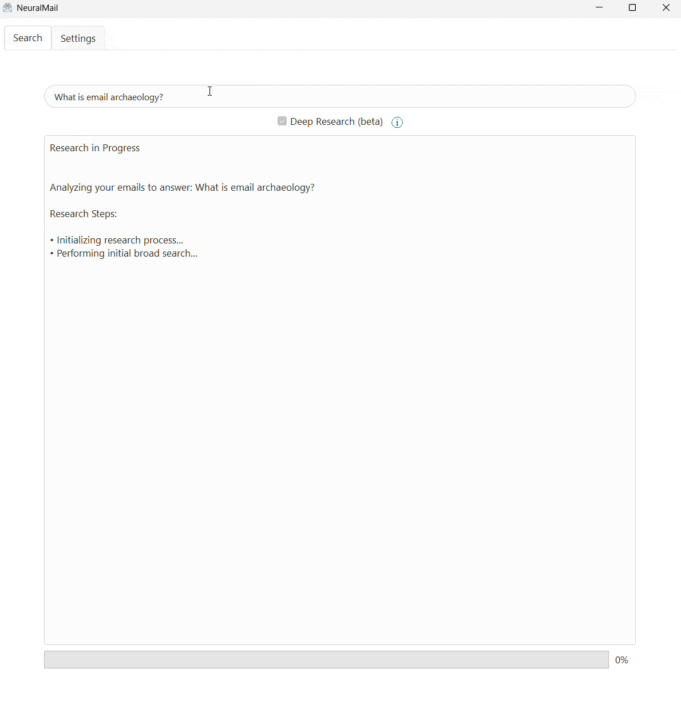

# NeuralMail ✉️🔎

Battle-tested email archaeology application that allows you to search and compile reports from multiple accounts. NeuralMail does not let you compose or sent emails, it tackles the problem of finding things of which you know they "must be in some email".



## Features ✨

- **Multiple IMAP Account Support** 💼: Manage and search across multiple email accounts simultaneously.
- **Smart Search** 🔍: Use natural language to search through your emails and their attachments, build reports.
- **Attachment Processing** 📎: Automatically extracts and processes text from PDF and DOCX attachments.
- **Deep Research Mode** 🧠: Agent-based analysis mode that performs thorough research across your emails.
- **Creates a user profile for improved retrieval** 👤: Context engineering to give the model more relevant concepts.
- **Parallel Processing** ⚡: Efficient email synchronization and deep research using parallel processing
- **Modern UI** 🎨: Clean, cross-platform UI
- **Local Storage** 💾: All data stored locally for privacy and quick access; LLMs can be local or remote (OpenAI compatible API provider); Gemini Flash gives a great performance / cost balance.
- **Warning** ⚠️: IMAP passwords and API keys are currently stored unencrypted in a local configuration file.

## Requirements 📋

- Python 3.8 - 3.12
- OpenAI API key or compatible local provider; Works great with Gemini Flash through OpenRouter for optimal performance/cost balance 
- IMAP email account(s)

## Installation 🛠️

### Option 1: Install with pip (Recommended)

1. Create and activate a virtual environment:
```bash
# On Windows
python -m venv venv
venv\Scripts\activate

# On macOS/Linux
python3 -m venv venv
source venv/bin/activate
```

2. Install directly from source:
```bash
pip install git+https://github.com/jmrk84/neuralmail.git
```

Or if you have the source code locally:
```bash
git clone https://github.com/jmrk84/neuralmail.git
cd neuralmail
pip install .
```

### Option 2: Development Installation

If you want to contribute or modify the code:

1. Clone and install in editable mode:
```bash
git clone https://github.com/jmrk84/neuralmail.git
cd neuralmail
pip install -e .
```

## Quick Start 🚀

1. Launch the application:
```bash
neuralmail
```

2. First-time setup:
   - Click "Add Account" to configure your first email account
   - Enter your IMAP server details (host, port, username, password)
   - Add your API key
   - Select which email folders to sync
   - Click "Save Settings"

3. Basic usage:
   - Click "Sync Emails" to download and process your emails (auto-sync on startup and in intervalls)
   - Enter a natural language query in the search box
   - Choose between "Quick Search" or "Deep Research" mode

## Configuration ⚙️

### Example IMAP Settings ✉️
- Gmail: 
  - Host: imap.gmail.com
  - Port: 993
  - SSL: Enabled
  - Note: Requires "App Password" if 2FA is enabled

- Outlook:
  - Host: outlook.office365.com
  - Port: 993
  - SSL: Enabled

### Database 🗄️
- Each account uses a separate SQLite database
- Default location: `emails_[account_number].db`
- Can be configured to custom location

## Development 🧑‍💻

### Project Structure 🗂️
- `neuralmail/main.py`: Main application file with GUI
- `neuralmail/parallel_email_sync.py`: Parallel email synchronization implementation
- `neuralmail/deep_research_worker.py`: Deep research mode implementation
- `neuralmail/research_tools.py`: Research utilities and tools
- `neuralmail/model_interface.py`: OpenAI/LLM API interface
- `neuralmail/research_agent.py`: Intelligent research agent implementation
- `neuralmail/config.py`: Configuration management
- `neuralmail/utils.py`: Utility functions
- `setup.py`: Package installation configuration


## Contributing 🤝

1. Fork the repository
2. Create a feature branch
3. Make your changes
4. Test the app properly
5. Submit a pull request

## Security Notes 🔒

- Email credentials and API keys are stored locally in `config.json`

## License 📄

This project is licensed under the MIT License - see the [LICENSE](LICENSE) file for details.


## Contributions 💬

Please feel free to create github issues and pull request. Contributions welcome! I'd love if the functionality got integrated into K9-mail, Thunderbird or any other open-source client.
